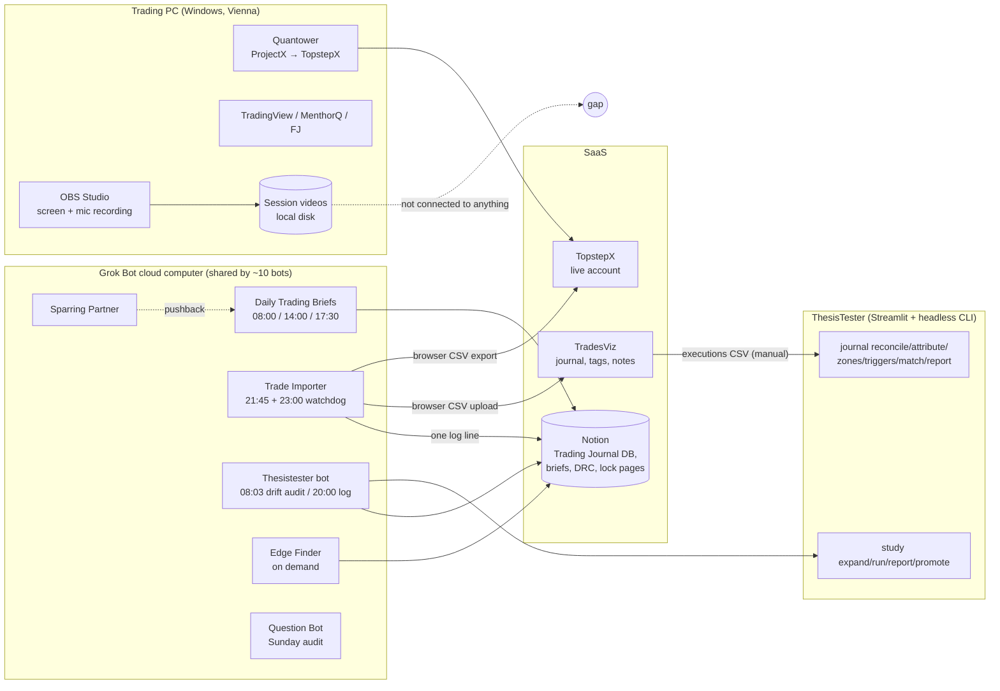

# 01 — Discovery: what already exists on the desk

Snapshot taken **12 Sep 2026** from the Notion workspace (Trading hub, Grok Bot
Routines, Trading Journal, Trading Plan / Methodology 1.1, DRC template, Process
and roadmap lock page), the public ThesisTester repository docs, and vendor
documentation (TopstepX / ProjectX, TradesViz, OBS, Quantower, xAI, Google).

The ThesisTester Origin repository itself was not readable from this session
(token scoped to this repo only); everything about ThesisTester below comes from
its public GitHub docs and the Notion lock page.

---

## 1. The ecosystem today

**The gap is the dashed line.** Session videos are recorded every day (the DRC
tech-check has "Boot OBS + Mic" and the review step "Yesterday's Trading
Video"), the Ecosystem Map lists "Trade Videos → AI Summaries" under Journaling,
but nothing consumes the videos today. Every other artifact on the desk is
already machine-readable and bot-maintained.

---

## 2. Component-by-component findings

### 2.1 Trading process and rules (Trading Plan, Methodology 1.1, DRC)

The desk has an unusually explicit, written rulebook. That matters because a
coach can only grade adherence against rules that are stated. Extracted rules
(these become the **rule catalog** in `02_SCOPE.md`):

| Area | Rule as written | Source |
|---|---|---|
| Hard protections | Daily loss limit **$200** at broker; circuit breaker after a **5 min loss**; **3 consecutive losses → 30 min timeout**; **max 10 trades/day** | Trading Plan §7, Methodology §7 |
| Hard protections | Max daily loss **$100** | DRC template ("Harte Tagesregeln") — **conflicts with $200**; needs one truth |
| Re-entry | Stopped on entry → one re-entry allowed; second failure → 5 min block, next trade is a new trade. Stopped mid-trade → 5 min block | Trading Plan §6 |
| Trade management | SL/TP changed only when new information invalidates the setup | Trading Plan §5 |
| Setup discipline | "Ein Trade muss einem Playbook folgen. Kein on-the-fly entering." Entry checklist: bias current, active trade zone, playbook membership, awareness of 5m/30m candle close, entry/invalidation/target defined, microstructure aligned, arrival candle close, risk acceptance | Trading Plan §3 |
| Trend logic | In-trend can enter aggressively; counter-trend requires **3c** confirmation | Methodology §2 |
| Time discipline | Evaluate tradeability at least hourly; hourly check-ins 10 min before the full hour; use no-trade zones for analysis | Trading Plan §1, DRC |
| Mental | TILT → cool down + resonance breathing; DRC mental check-in scores (Ängste, Ungeduld, Frustration, Müdigkeit, /40) | DRC |
| Journaling | Every trade goes into the journal; trades are recorded with OBS | Trading Plan §5 |
| Known leak | "rushing the touch and reentering 2-3 times" (swing product) | Process and roadmap lock page |

Playbooks currently named in Notion: *30pVWAP reversal in trend*, *Book
injection*, *Book Injection Flips*, *In trend reversal SFPs*, sub-playbooks
*Candle gap down*, *Main First Response (MFR)*. Two locked products in the lab:
**scalp** (touch @1m, 10-tick zone, 40/40) and **swing** (3c @1m, 20-tick zone,
80/80), both with `dVWAP` partner.

Language: rules and DRC are German; briefs, lock pages and bot prompts are
English; the trader's spoken commentary is presumably mixed. The ASR layer must
handle German/English code-switching and trading jargon (ONH, dVWAP, 3c, pwEQ,
HVL, MNQ...).

### 2.2 Grok Bot fleet (Notion "Grok Bot Routines", audited weekly)

Ten named bots on **one shared cloud computer** with a shared Chrome profile,
Notion via MCP connector, cron-style routines in Europe/Vienna, agent-to-agent
handoffs (briefs → sparring partner; analysts → dates-of-interest), and hard
rules baked into every prompt ("never invent numbers", "mark missing as
missing", "stay quiet if nothing changed", "never type a password").

Relevant conventions the new app should respect, because the bots already
enforce them:

- **Facts vs. interpretation are separated.** Briefs quote Quin verbatim under
  its own heading and never adopt its direction as the bias.
- **Source strip + Gaps section** on every page: live / pending / stale, name
  the hole.
- **One Notion log line per run**, newest first, on a fixed log page.
- **Quiet on success.** Chat pings only when something changed or broke.
- **Live-account lock.** Trade Importer may only log in → Layouts → export;
  never order endpoints.
- **Sunday audit** keeps the Notion roster and a Google Calendar in lockstep
  with live routine files.
- The **Trade Importer is the most fragile routine** (blocked runs: login
  walls, multiple-session kicks, upload stalls, exclusive end dates, year
  reset to 0202). It exists only because there was no API path.

Bots relevant to this project: **Trade Importer** (fills), **Thesistester /
Edge Finder** (lab results), **Daily Trading Briefs** (published bias per day),
and a future **Debrief / Coach** bot that does not exist yet (two empty "New
Agent" stubs are available).

### 2.3 ThesisTester (the lab)

Public repo `AccumuLatata/ThesisTester`: Streamlit app + `pip install -e .`
library + headless CLI (`python -m thesistester ...`). MIT. Python 3.10–3.12,
ruff, pytest, golden-master guard. Docs are extensive and the engineering style
is "plan lock → numbered milestones → additive packages → no golden regen".

Two surfaces matter here:

1. **Study Runner** (`study expand|run|report|promote|rollup`) with an
   explicit *Grok Bot routine pack* (`docs/STUDY_RUNNER_GROK_ROUTINE_PACK.md`).
   Stated posture: *"ThesisTester does not embed Grok, host multi-agent queues,
   or ship an MCP server. CLI is the durable contract."* This is the proven
   headless-integration pattern on this desk and the new app should copy it.
2. **Trade Journal (TJ0–TJ9, complete) and Journal→Study (JS0–JS2 landed).**
   Ingests the **TradesViz executions CSV** (`tradesviz_executions` profile;
   *"the journal clock and the intent source"*) into `FillRecord`, pairs into
   `JournalTrade` (spread_id + FIFO), reconciles against AMP statements,
   joins to the 15s/1m clock, **attributes every entry bar to the engine's
   closed level tokens**, replays counterfactuals (fixed bracket, direction
   shuffle, declared rules), matches named systematic cells, infers the
   trigger the engine would have called (`journal zones` / `journal triggers`),
   and reports Q1–Q8. Explicitly *does not rebuild generic journal statistics
   TradesViz already ships*. "Tags are intent, not evidence." Quantower Trades
   loader parked (its clock is Vienna local, not NY).

Consequence for scope: **level attribution, trigger inference, R math and
counterfactuals already exist in ThesisTester.** The new app must not rebuild
them. Its unique contribution is *evidence from the recording* (what the trader
said, saw and did, time-stamped) and the *daily debrief* that joins evidence,
fills, lab attribution and the day's published brief.

Another consequence: TradesViz tags/notes are today the only "intent" input to
TJ and they are typed by hand. Spoken commentary is a much richer and cheaper
intent source; the app can *propose* tags/notes from speech.

### 2.4 Fills: TopstepX, Quantower, TradesViz

| Source | Access | Timestamps | Notes |
|---|---|---|---|
| **TopstepX ProjectX Gateway API** | REST + SignalR, bearer JWT. `POST /api/Trade/search {accountId, startTimestamp, endTimestamp}` returns half-turn fills (`creationTimestamp`, `price`, `side`, `size`, `profitAndLoss`, `fees`, `orderId`, `voided`). `POST /api/History/retrieveBars` returns OHLCV. | ISO-8601 UTC | **$29/mo, 50% off with code `topstep` → $14.50/mo.** Key is full-trading scope — store like a password. Topstep ToS: read-only logging/analytics on a private server is explicitly allowed; order transmission from a server is not. No sandbox; Practice account uses the same endpoints. |
| TopstepX web export (current) | Browser: Layouts → trade export → EXPORT → CSV | account tz (US/Central) | What Trade Importer does today. Fragile (see 2.2). |
| Quantower | Order History / Time & Sales panel → Export Data → CSV; Algo API `Core.Trades` | Europe/Vienna local | ThesisTester parked this loader because of the clock. |
| **TradesViz executions export** | Import → Export/Manage → Existing Uploads → *Executions* + *Native* → CSV. No public API found; auto-sync is broker-side and daily. | as imported | The clock ThesisTester TJ is built on. Carries tags, notes, declared SL/TP (intent). |

Recommendation carried into the roadmap: adopt the **TopstepX API as the
primary, automatic fill source** (read-only client; order endpoints never
implemented), keep producing a CSV that TradesViz can ingest so the human
journal and ThesisTester TJ keep working unchanged, and retire the browser
export to a fallback. This removes the desk's most fragile routine as a side
effect.

### 2.5 Recording: OBS

- OBS ≥ 30.2 **Hybrid MP4** is crash-recoverable (matters for multi-hour
  sessions), sets the file **creation time to recording start**, and supports
  **chapter markers** via hotkey, `obs-websocket CreateRecordChapter`, or the
  frontend API. Chapters survive file splitting on OBS ≥ 32.1.
- Filename formatting (`%CCYY-%MM-%DD %hh-%mm-%ss`) gives the wall-clock start
  in the PC's local timezone (Vienna). This is the primary clock anchor for
  aligning video time to fill time.
- OBS records up to six **separate audio tracks**. Putting the microphone on
  its own track (and desktop audio / any Grok voice on another) removes the
  need for speaker diarization entirely.
- `obs-websocket` also exposes recording start/stop events, which can trigger
  the pipeline the moment a session ends.

### 2.6 Notion as the human surface

`Trading Journal` database (`collection://3a895663-…`): title, `Summaries`,
`Learning 1–3`, `Tags` (multi-select incl. *Trades Summary*, *Daily Report
Card*, *Weekly Recap*, *Monthly Recap*), `WL`, `W/L Day`, `Created time`.
Calendar view by created time. Briefs are pages in this DB titled
`<D Mon YYYY> Macro Brief` / `NY session Brief`; DRC pages are titled
`DRC ddmmyyyy`. A daily debrief page fits this DB with tag *Trades Summary*
without schema changes.

---

## 3. What is missing (the opportunity)

1. **No evidence layer.** Fills say *what* happened; TradesViz tags say what
   the trader *claims* he intended, typed after the fact; the lab says whether
   the *location* had descriptive edge. Nobody records what the trader *said
   and saw at the moment of the decision*. The videos contain exactly that.
2. **No daily join.** Brief (bias) ↔ DRC (mental state) ↔ fills ↔ lab
   attribution ↔ commentary all live in different places with different clocks.
3. **Rule adherence is unmeasured.** The rulebook is explicit but adherence
   (re-entry rule, 30 min timeout, hourly check-in, playbook named before
   entry, arrival-candle-close wait) is never scored.
4. **Intent is expensive.** TJ needs hand-typed TradesViz tags; speech already
   contains the intent.
5. **The fill import is the weakest link** and there is a documented API that
   makes it unnecessary.

---

## 4. Evidence index (for later verification)

| Claim | Where verified |
|---|---|
| Bot roster, routines, hard rules, access table | Notion *Grok Bot Routines* (snapshot 6 Sep 2026) |
| Import log format and failure modes | Notion *Trade-Imports from TopstepX into Tradesviz* |
| Rulebook | Notion *Trading Plan*, *Trading Methology 1.1*, *DRC 15062026* |
| Locked products, decision rules, level vocabulary | Notion *Process and roadmap* (locked 19 Aug 2026) |
| ThesisTester CLI, journal package, Grok pack posture | GitHub `AccumuLatata/ThesisTester` README, `docs/ENGINEERING_ROADMAP.md`, `docs/STUDY_RUNNER_GROK_ROUTINE_PACK.md`, `docs/TRADE_JOURNAL_IMPLEMENTATION_PLAN.md` |
| TopstepX API endpoints, pricing, ToS on servers | `api.topstepx.com/swagger`, Topstep Help Center *TopstepX API Access* |
| TradesViz export / no public API | TradesViz FAQ + Crisp guides |
| OBS Hybrid MP4, chapters, creation time | obsproject.com/kb/hybrid-mp4, obs-studio PR #12807 |
| Quantower exports | Quantower help (Time & Sales), Topstep *Quantower Connection Instructions* |
