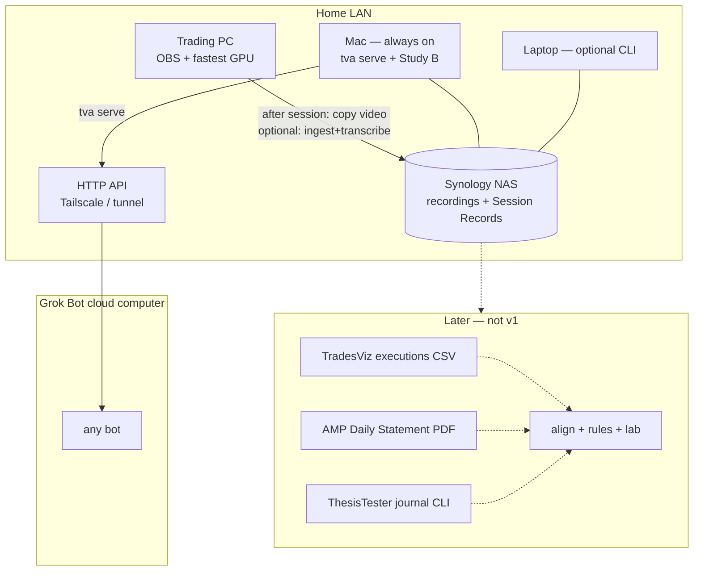

# 04 — Architecture (high level)

No code yet. This fixes the shape: where things run, what flows between
machines, what the contracts are, and how the bots consume the API.

---

## 1. Shape in one picture



The NAS is the shared disk. The Mac is the default API host. The trading PC
is the default *processing* host. Grok never sees the raw video.

---

## 2. Where does it run? (locked — D1, D3, D9)

| Machine | Role | Why |
|---|---|---|
| **Trading PC** | Record locally. After OBS stops: copy the Hybrid MP4 to the NAS. Prefer running ingest + transcribe here (fastest GPU). | Videos are born here. Do **not** record OBS directly onto SMB. |
| **Mac** | Always-on. Default `tva serve`. Can run the pipeline if the PC did not (hosted ASR fallback if there is no GPU). Hosts ThesisTester Study B today; disk is already tight — that is why the NAS exists. | Bots need a process that is up in the evening. |
| **Laptop** | Same CLI, same `TVA_ROOT` on the NAS mount. Ad-hoc / travel. | One codebase, path-configured. |
| **Synology NAS** | Source of truth for recordings and Session Records. Not a compute node. | See §2.1. |
| **Grok cloud computer** | HTTP client only. | Cannot mount the NAS. |

This is still topology **T1** (edge-heavy): media stays on the LAN; only
JSON (and, if a bot asks, a small clip) leave via the API.

### 2.1 Synology as the store — yes, with four rules

A home NAS is the right answer to "how do three machines and a future
private cloud share the tapes." It is a better D3 than Google Drive for
multi-GB video.

1. **Record local, copy after.** OBS Hybrid MP4 onto a Synology share drops
   frames and makes crash-recovery less useful. Trading PC SSD → post-session
   copy to `TVA_ROOT/recordings/` (never record OBS onto the NAS). A 20–40 GB
   file wants wired Ethernet (2.5G/10G if you have it); Wi-Fi copies will
   still be running when the evening bot fires. `tva watch --source <obs dir>`
   does the copy (`.part` + `recordings/<name>.lock`, never deletes the
   source). Desk wiring:
   [`scripts/windows/tva-watch.xml`](../scripts/windows/tva-watch.xml)
   (Task Scheduler),
   [`scripts/windows/copy-after-obs.ps1`](../scripts/windows/copy-after-obs.ps1)
   (one-shot),
   [`scripts/mac/com.tva.watch.plist`](../scripts/mac/com.tva.watch.plist)
   (launchd).
2. **One env var, same layout everywhere.** `TVA_ROOT=/Volumes/tradevid` or
   `T:\tradevid`. Layout:
   `recordings/`, `sessions/<id>/`, `fixtures/`. The API and the CLI both
   take `--root` / `TVA_ROOT`.
3. **Snapshots, not just RAID.** The tapes are irreplaceable. Synology
   Btrfs snapshots + a second-destination Hyper Backup (USB or offsite)
   beat a bigger volume.
4. **The NAS does not make the cloud bot local.** Grok still needs a
   reachability path to `tva serve` on the Mac: **Tailscale** (Synology has
   an official package; the Mac can also advertise the subnet) or a
   **Cloudflare tunnel**. No public port-forward of the API. The bot stores
   a Tailscale/Funnel URL, not a `192.168.x` address.

Until the NAS is on the desk, a folder on the Mac is a fine `TVA_ROOT`.
The app must not care.

### 2.2 Secrets

xAI (extraction) and any hosted ASR key live in the OS keychain /
environment on the machine that calls out. Never in a world-readable NAS
share. The bot's existing first-line password-file convention is acceptable
on the bot box only if the app never logs or echoes them.

No broker API keys in v1.

---

## 3. Pipeline stages and surfaces

Every stage is a CLI subcommand, idempotent, writing into
`$TVA_ROOT/sessions/<id>/`. The API exposes the same artifacts.

| Stage | CLI | API (sketch) | Output | v1? |
|---|---|---|---|---|
| Register | `tva ingest <video.mp4>` | `POST /sessions` (path on NAS) | `session.json`, `audio/mic.opus` | yes |
| Transcribe | `tva transcribe <session>` | (kicked by `POST /sessions/{id}/run`) | `transcript.json` | yes |
| Extract | `tva extract <session>` | same | `insights.json` (cited) | yes |
| Frames | `tva frames <session> [--at t…] [--contact-sheet]` | CLI (keyframes stay on `TVA_ROOT`; not a bot media route) | `frames/<t>.jpg` + optional contact sheet; OCR/clips later | yes, optional |
| Status | `tva status` | `GET /sessions`, `GET /sessions/latest` | stage states | yes |
| Read | — | `GET /sessions/{id}`, `/transcript`, `/insights` | JSON | yes |
| Doctor | `tva doctor` | `GET /health` | ffmpeg / GPU / keys / NAS mount | yes |
| Fills | `tva fills <session>` | — | TradesViz executions → trades | **later** |
| Align | `tva align <session>` | — | video ↔ fill clock | **later** |
| Rules | `tva rules <session>` | — | scorecard | **later** |
| Context | `tva context <session>` | — | briefs + ThesisTester attribution | **later** |

`tva run --latest` is the scheduler entry on the PC. `tva serve` is the
Mac entry. Same package.

---

## 4. The Session Record (v1 contract sketch)

Versioned JSON. Illustrative, not final:

```yaml
session:
  id: 2026-09-11                 # trading session date, ETH 18:00 ET
  recording: {path, sha256, start_wallclock_vienna, duration_s, tracks: [mic], chapters: [{t, name}]}
  language: de                   # primary; segments may flip
  alignment: null                # later: offset_s, confidence, method

transcript:
  provider: whisperx; model: large-v3; prompt_version: jargon-v1
  segments: [{id, t0, t1, lang, text, words: [{w, t0, t1, p}]}]

insights:                        # model-derived, every field cited or null
  bias_statements: [{seg, text, t}]
  playbooks_mentioned: [{seg, name}]
  stated_levels: [{seg, token}]  # ONH, dVWAP, … as spoken, not as lab truth
  stated_stops_targets: [{seg, raw_text}]  # raw speech, not parsed prices
  checkins: [{seg, t, text}]
  tilt_markers: [{seg, text}]
  brief_refs: [{seg, text}]
  observations: [{seg, text}]    # labelled interpretation
  gaps: [string]                 # what the extractor could not hear
  session_events: [{t, kind, seg, text}]
    # kind ∈ hourly_checkin|bias_statement|no_trade_zone|trade_zone|tilt|
    #         break|rule_mention|brief_ref|grok_ref
  summary_de: string             # labelled prose, ≤ 120 words
  summary_en: string
  # PR-08: provider/model/prompt_version; grok windows ≤40 / overlap 5
  # citation failures drop into gaps[] (unknown seg or fabricated quote)
  # PR-09: events from a second pass (ids + first-pass citation ids, no
  # transcript text; event text re-hydrated); summaries drop if they contain
  # a digit run that is not an exact digit run in any *valid* cited segment

fills: null                      # later
trades: null                     # later
rule_checks: null                # later
context: null                    # later — briefs, DRC, lab

provenance: {app_version, ffmpeg, models, created_at}
```

Hard rules: every model-derived field has a sibling reference; every number
that is not later supplied by fills or OCR is `null` or raw quoted text,
never estimated.

PR-08 extractor: `tva extract --provider grok` (`XAI_API_KEY`, optional
`TVA_EXTRACT_MODEL`). System prompt is `prompts/insights_v1.de.md`;
`prompt_version` is `{stem}+{sha256[:12]}`. Fake keyword scan stays the
default so CI never calls xAI.

PR-09: additive `session_events` / `summary_de` / `summary_en` on the same
`schema_version: "1"`. Grok’s second pass uses `prompts/events_v1.de.md`
and the closed `kind` set above. The citation guard covers events and
rejects summaries whose digit runs are not exact runs in a valid cited
segment (`summary_de` also capped at 120 words).

---

## 5. Relationship to ThesisTester and the journal (later)

v1 has **no import** of ThesisTester and **no fill join**. That is
intentional (see `02_SCOPE.md` §4).

When we do join, the direction is still "consume, do not fork":

- **TradesViz executions CSV** is the broker-agnostic fill clock (TopstepX
  and AMP already land there). ThesisTester's `tradesviz_executions`
  profile is the proven parser — call it or contract-test against it.
- **AMP Daily Statement PDF** is FCM money truth (fees, P&S). ThesisTester
  already owns `amp_statement`. Use it; do not re-parse the PDF.
- **ThesisTester** `journal attribute|zones|triggers` supplies level tokens
  and inferred triggers. TradeVidAnalyser never computes levels.
- Spoken setup names become *proposed* TradesViz tags (`proposed` until a
  human confirms). Tags stay intent, not evidence.

Good reasons to do that join *eventually*:

- Speech alone is "he said ONH." Speech + fill is "he said ONH and filled
  eight seconds later four ticks through." That is the coaching that
  changes behaviour.
- Speech + lab is "he named the scalp playbook at a location the study
  says is a coin flip." Edge Finder can use that.
- TradesViz already solved "I trade more than one venue." We should not
  undo that by growing a TopstepX client as the spine.

Good reasons **not** to do it in v1: it delays the only thing that does
not exist today (tape → structured German transcript → Grok), and it
couples the first useful API to a second repo and a journal export ritual.

---

## 6. Bot integration (v1)

- **Any Grok bot**, on demand or as an evening routine: `GET /health`,
  then `GET /sessions/latest`. Evening only proceeds when `session.id`
  starts with **today’s** Europe/Vienna date. If `insights` is present,
  write the bot's own Notion note. If a stage is `missing` or `failed`,
  ping. 23:30 watchdog unless *TVA runs* already has `status ok` for
  today’s session id (a today-dated line for yesterday does not count).
- **Hard rules:** never edit `insights.json` / `transcript.json`; never
  invent a quote; every quoted line must exist in `transcript.json`; never
  treat a spoken price as a fill; never call anything but the API.
- **Reachability:** Tailscale URL or Cloudflare tunnel to the Mac, stored
  like any other bot secret. Not a LAN IP. `tva serve` may bind loopback
  without a token. Binding off-loopback (Tailscale IP, `0.0.0.0`) requires
  `TVA_API_TOKEN`; the process refuses to start without it. Clients send
  `Authorization: Bearer …`. Clips stay off unless `TVA_SERVE_MEDIA=1`.
- Sunday audit (Question Bot): `GET /sessions?days=7` + `/health`.

Copy-ready pack: [`TVA_GROK_ROUTINE_PACK.md`](TVA_GROK_ROUTINE_PACK.md)
and [`examples/bot/`](../examples/bot/). Paste `SYSTEM.md` as the bot
system prompt; schedule evening + Sunday + 23:30 Vienna watchdog.

A dedicated "TradeVid bot" is optional. v1 is useful to the bots that
already exist.

---

## 7. Quality gates (engineering)

- Golden session: one redacted real-session excerpt (German commentary,
  20–30 min) in a *private* fixtures location (NAS, not this public-ish
  repo). Hand-corrected transcript for WER.
- `ruff` + `pytest` in CI. Provider adapters with a `fake` implementation.
- No ThesisTester import in the v1 package metadata.
- API contract tests against committed example JSON (no video in CI).
