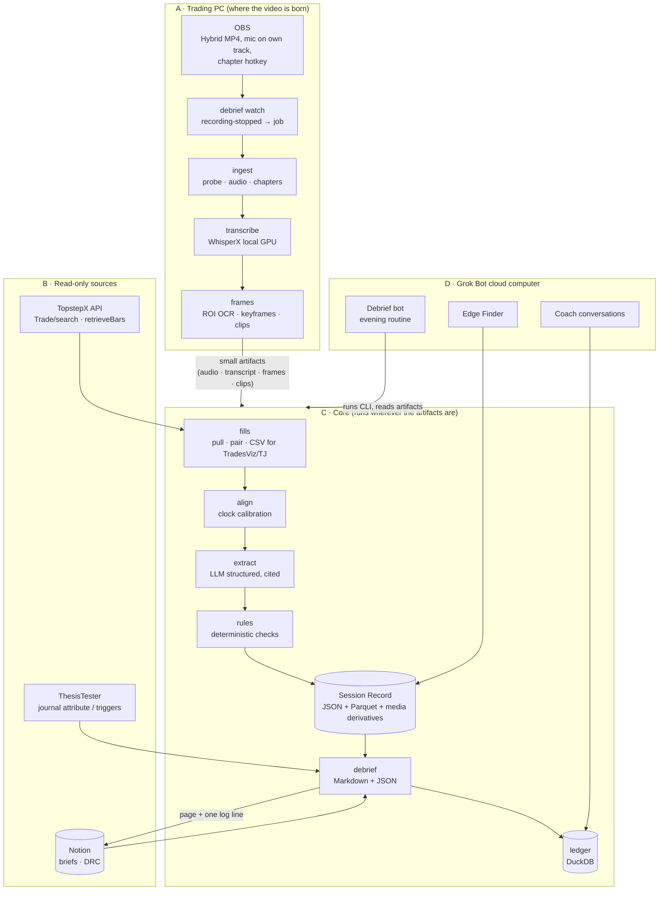

# 04 — Architecture (high level)

No code yet. This fixes the shape: where things run, what flows between them,
what the contracts are, and how the bots drive it.

---

## 1. Shape in one picture



Boxes A and C may be the same machine. Box D is never where the video is.

---

## 2. Where does it run? (the topology decision)

The session videos are large: a 5–6 h 1080p/60 OBS recording at typical
bitrates is **several GB**; a week is tens of GB. The Grok bots run on a cloud
computer with `/workspace`, no GPU, and a browser that is deliberately kept
signed *out* of the personal Google account. So the question "where does
Debrief run" has a real answer, not a preference.

| Topology | How | Pros | Cons |
|---|---|---|---|
| **T1 · Edge-heavy (recommended)** | Full media pipeline (ingest, ASR, OCR, clips) runs on the trading PC (or the Mac that already hosts the Program B farm) right after the session. Only artifacts (≈ 50–150 MB/session: Opus audio, transcript, keyframes, clips, JSON) are pushed to a sync location the bot can read. The bot runs the *core* steps that need the internet APIs and Notion, or the PC runs everything and the bot only reads. | Video never leaves the desk (PII); local GPU makes ASR free and fast; no upload of GBs; matches Topstep's "read-only on private server" allowance. | Trading PC does post-session work (schedule it after the session, low priority); needs a sync path (see §2.1). |
| T2 · Bot-heavy | Videos synced to cloud storage; the bot's cloud computer downloads and processes. | Nothing to install on the PC beyond a sync client. | Multi-GB uploads daily; no GPU on the bot box → hosted ASR/VLM for everything; full-frame PII leaves the desk. |
| T3 · Audio-only to bot | PC extracts and uploads audio + a few hundred keyframes; bot does ASR via hosted API, OCR on frames, everything else. | Small uploads; PC does almost nothing. | Loses the ability to cut clips later without the video; hosted ASR cost; still needs an install on the PC for extraction. |

**Recommendation: T1**, with T3 as the degraded mode when the PC is off.
Concretely: a small Windows service / Task Scheduler job (`debrief watch`)
triggered by OBS "recording stopped" (obs-websocket) or by a nightly timer.

### 2.1 The artifact handoff

Options for moving ≈ 100 MB/session from the PC to the bot: a Google Drive
folder on the **tradingautomations1@gmail.com** account (already allowed to be
signed in on the bot box), an S3/B2 bucket, or a private git-LFS repo. Any of
them works; the app treats the artifact root as a path and stays
storage-agnostic. Notion receives only the debrief page and one log line,
never media.

### 2.2 Secrets

TopstepX API key, xAI/Google keys: OS keychain / environment on the machine
that calls the API. The bot's convention (`/workspace/tt.md`-style first-line
password files) is acceptable for the bot box only if the app never logs or
echoes them. The TopstepX client refuses to construct if any order endpoint
is referenced (unit-tested guard).

---

## 3. Pipeline stages and CLI surface

Every stage is a CLI subcommand, idempotent, writing into a per-session
directory. Same argv works for a human, a scheduler, or a bot.

| Stage | Command (sketch) | Input | Output | Deterministic? |
|---|---|---|---|---|
| Register | `debrief ingest <video.mp4>` | OBS file | `session.json` (id, wall-clock start, duration, tracks, chapters, hashes), `audio/mic.opus`, `audio/desktop.opus` | yes |
| Transcribe | `debrief transcribe <session>` | audio | `transcript.json` (segments + words + confidences, language per segment, provider/model) | model-dependent, pinned |
| Fills | `debrief fills <session>` | TopstepX API (or CSV fallback) | `fills.parquet`, `trades.parquet` (ThesisTester `FillRecord`/`JournalTrade` shape), `tradesviz_import.csv` | yes |
| Align | `debrief align <session>` | session + ROI OCR of clock | `alignment.json` (offset, drift, confidence, method) | yes |
| Frames | `debrief frames <session>` | video + trades + alignment | `frames/*.jpg` (entry/exit/±), `ocr.parquet` (ROI text with confidence), `clips/trade_<id>.mp4` | yes |
| Extract | `debrief extract <session>` | transcript + trades + frames | `evidence.json` (per-trade evidence, session events; every claim cites segment/frame ids) | model, pinned prompt |
| Rules | `debrief rules <session>` | trades + evidence + alignment | `rules.json` (pass/violated/unverifiable + refs) | yes |
| Context | `debrief context <session>` | Notion briefs, DRC; ThesisTester `journal attribute/triggers` output | `context.json` (bias of the day, DRC scores, level tokens per trade) | yes (reads) |
| Debrief | `debrief report <session>` | everything above | `debrief.md`, `debrief.json` | model for prose, facts verbatim |
| Ledger | `debrief ledger add <session>` | debrief.json | `ledger.duckdb` rows | yes |
| Publish | `debrief publish <session> --notion` | debrief.md | Notion Trading Journal page, one log line | yes |
| One-shot | `debrief run --latest` | — | all of the above, resumable, machine-readable exit status + `status.json` | — |

`debrief status` prints the last N sessions and their stage states for the
Sunday audit. `debrief doctor` checks ffmpeg, GPU, model weights, API keys,
OBS settings.

---

## 4. The Session Record (contract sketch)

Versioned JSON schema (Pydantic models; `schema_version` on every file).
Illustrative, not final:

```yaml
session:
  id: 2026-09-11                 # trading_session_date, ThesisTester convention (eth_start 18:00 ET)
  recording: {path, sha256, start_wallclock_vienna, duration_s, tracks: [mic, desktop], chapters: [{t, name}]}
  alignment: {offset_s, drift_s_per_h, confidence, method: ocr_clock|filename|manual}

transcript:
  provider: whisperx; model: large-v3; prompt_version: jargon-v1
  segments: [{id, t0, t1, lang, text, words: [{w, t0, t1, p}]}]

fills:   # ThesisTester FillRecord shape, source: topstepx_api|tradesviz_executions
trades:  # ThesisTester JournalTrade shape + debrief ids

trade_evidence:
  - trade_id: T03
    window: {t0, t1}                          # entry −180 s … exit +120 s, video time
    commentary: [seg_412, seg_413, seg_419]   # refs, quotes rendered from transcript
    stated: {setup: "ONH touch scalp", bias: "up", stop: 29380, target: 29450, playbook: "MFR"}  # each with seg ref or null
    markers: [{kind: tilt|hesitation|rule_mention|brief_ref|grok_ref, seg}]
    frames: [{t, path, kind: entry|exit|pre|post}]
    ocr: [{t, roi: clock|pnl|position, text, confidence}]
    clip: clips/T03.mp4
    visual_notes: {provider: grok-4.3, prompt_version, notes: [...], frames_cited: [...]}   # optional

session_events:
  - {t, kind: hourly_checkin|bias_statement|no_trade_zone|trade_zone|tilt|break, seg, text}

rule_checks:
  - {rule: R-3L30, status: violated, evidence: {loss_streak_exit: ..., next_entry: ..., gap_s: 412}}
  - {rule: R-PLAYBOOK, status: unverifiable, reason: "no speech in pre-entry window"}

context:
  brief: {macro_url, ny_url, bias_nq, bias_es, conviction, kill_levels}   # quoted, not re-derived
  drc: {scores, notes_url}
  lab: {per_trade_level_tokens, inferred_trigger, product_match}        # from ThesisTester journal

debrief:
  generated_by: {model, prompt_version}
  markdown: debrief.md
provenance: {app_version, ffmpeg, models, created_at}
```

Two hard rules for the schema: every model-derived field has a sibling
reference to the evidence it came from; every number that is not a fill or an
OCR read is `null`, never estimated.

---

## 5. Relationship to ThesisTester

Debrief **depends on** ThesisTester as a library/CLI, it does not fork it:

- Reuse `FillRecord` / `JournalTrade` contracts and the `tradesviz_executions`
  profile so `trades.parquet` and `tradesviz_import.csv` are directly loadable
  by `journal …`.
- Call `journal attribute` / `journal zones` / `journal triggers` (or their
  library functions) to obtain level tokens and inferred triggers per entry;
  Debrief never computes levels itself.
- Feed back **proposed intent tags** (from speech) as a TradesViz-importable
  notes/tags column and as `intent_proposals.json`, so TJ's "tags are intent"
  input becomes cheap. Human confirms in TradesViz; Debrief marks them
  `proposed` until then.
- Later (post-v1): `journal propose-study` (JS3) could take Debrief's
  frequency of *stated* setups as one more input, human-gated as always.

If depending on the ThesisTester package is inconvenient early on, mirror the
two schemas exactly and add a contract test that loads a Debrief CSV with the
ThesisTester loader.

---

## 6. Bot integration (the routine pack)

Mirror `STUDY_RUNNER_GROK_ROUTINE_PACK.md`:

- **Debrief bot** — weekday routine after the fill import window (e.g. 22:15
  Vienna): `debrief run --latest`; on success `debrief publish --notion`;
  prepend one log line to a *Debrief runs* Notion page
  (`YYYY-MM-DD HH:mm Vienna | session YYYY-MM-DD | N trades | rules: X pass / Y viol / Z unverif | alignment 0.97 | published`);
  chat ping **only** on violations, gaps, or failure. 23:30 watchdog if no log
  line.
- **Hard rules for the bot:** never edit `evidence.json` / `rules.json`; never
  invent a quote; every quoted line must exist in `transcript.json`; report
  `unverifiable` as unverifiable; never call anything but the CLI; never touch
  order endpoints (there are none).
- **Coach prompt** (on demand or Sunday): reads `ledger.duckdb` and the last N
  debriefs; produces trend observations with citations; proposes at most one
  behavioural experiment for the week, phrased as a testable rule change.
- **Sunday audit** (Question Bot) adds Debrief's routines and the `debrief
  status` output to its checklist.
- **Trade Importer** becomes: "if Debrief's `tradesviz_import.csv` exists for
  today, upload it; else fall back to the browser export."

---

## 7. Quality gates (engineering)

- Golden session: one redacted 20–30 min recording + synthetic fills checked
  into a private fixtures location; every stage has a golden artifact; model
  stages have tolerance-based comparisons (WER, JSON field agreement).
- Contract tests against ThesisTester loaders.
- `ruff` + `pytest` in CI (GitHub Actions or Origin CI), Python 3.11+.
- Provider adapters (ASR / VLM / LLM) behind interfaces with a `fake`
  implementation for tests, so CI never calls a paid API.
